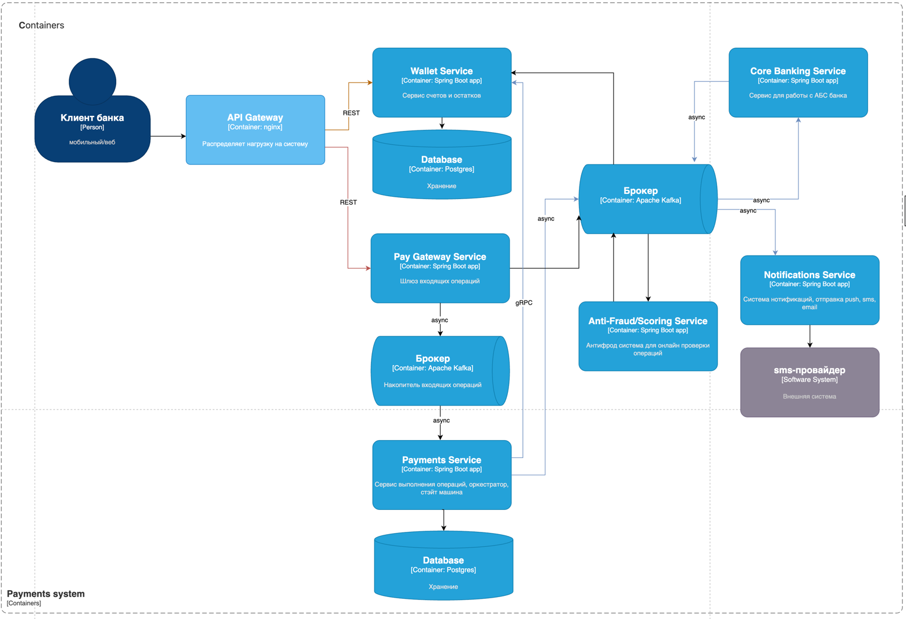
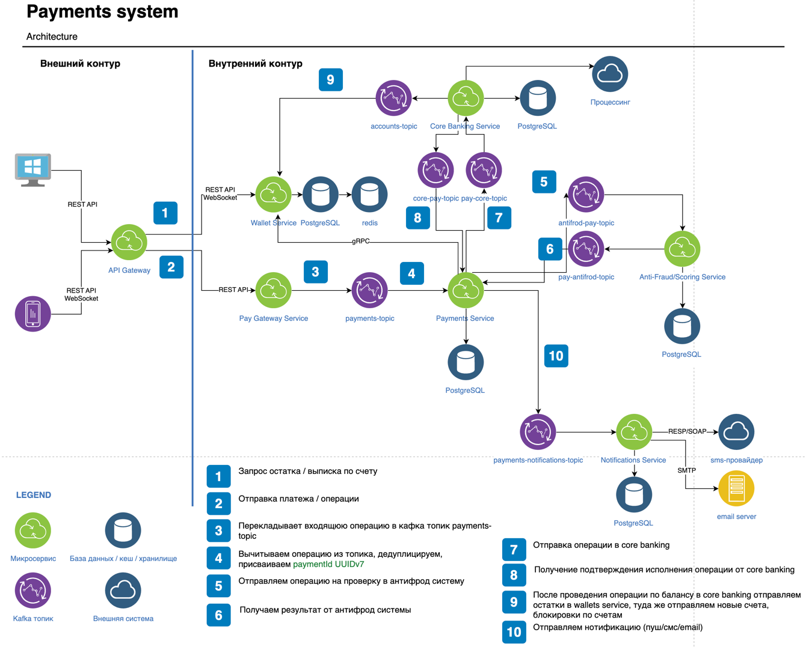

# Платёжная вертикаль банка

# 1. Bounded Context и Context Map

**Описание контекстов системы:**

### Customer Context
Клиенты системы, мобильное приложение и сайт
downstream по отношению к Wallet Context, upstream по отношению к Payments Context

### Wallet Context
Контекст счетов со всеми реквизитами и остатков по ним, блокировок по счетам. Операции по счетам. Единый источник истины 
балансов по счетам для всей системы. Также хранит историю изменений балансов.
OHS upstream по отношению к Customer Context и Payments Context, downstream ACL по отношению к Core Banking Context

### Payments Context
Контекст платежа / операции по счету со статусной моделью. Проводит операции по статусам с помощью стэйт машины.
downstream по отношению к Customer Context, downstream по отношению к Wallet Context
OHS upstream по отношению к Core Banking Context

### Core Banking Context (Legacy)
АБС банка, проводит операции по балансу, меняет остатки по счетам.
downstream по отношению к Payments Context, upstream по отношению к (поставляет изменения по счетам и остаткам) в Wallet Context

### Notifications Context
Контекст уведомлений, отвечает за отправку push, sms, email
downstream по отношению к Payments Context

### Anti-Fraud / Scoring Context
Антифрод система, проверяющая в онлайне каждый входящий платеж / операцию, upstream по отношению к Payments Context

### Context Map

# 2. C4-диаграммы

## Диаграмма C4 Context (C1)

## C4 Container (C2)

# 3. Коммуникации и протоколы

## Взаимодействия:

| Компоненты взаимодействия       | Описание                                         | Протокол                           | Обоснование                                                                                                                                                                                                                                                                   |
|---------------------------------|--------------------------------------------------|------------------------------------|-------------------------------------------------------------------------------------------------------------------------------------------------------------------------------------------------------------------------------------------------------------------------------|
| Клиент → API Gateway → Wallet   | Запрос остатка / выписки                         | REST API                           | Стандарт для веб-API и запрос с внешнего контура, клиенту нужен ответ в моменте поэтому синхронно                                                                                                                                                                             |
| Клиент → API Gateway → Payments | Создание платежа                                 | REST API                           | Стандарт для веб-API и запрос с внешнего контура, клиенту нужен ответ в моменте поэтому синхронно                                                                                                                                                                             |
| Payments ↔ Wallet               | Проверка остатка/резервирование/списание средств | gRPC                               | В этом месте важна синхронная консистентность, нам в моменте нужно проверить остаток на счете для проверки достаточности средств, поэтому операция синхронная и так как запрос внутри контура, то используем бинарный протокол gRPC, работает быстрее чем REST, сжатый трафик |
| Payments → Core Integration     | Проведение по core                               | события через брокер Apache Kafka  | Межсервисная интеграция с eventual consistency, cервисы слабо связаны                                                                                                                                                                                                         |
| Payments → Anti-Fraud/Scoring   | Проверка операции в анти-фрод системе            | команда через брокер Apache Kafka  | Отправляем команду через Apache Kafka в Anti-Fraud с целью проверить операцию и через обратный топик получаем ответ                                                                                                                                                           |
| Payments → Notifications        | Отправка нотификации                             | события через брокер Apache Kafka  | Уведомление пользователю об успешной транзакции отправляется асинхронно через событие, чтобы не задерживать основной поток                                                                                                                                                    |

# 4. Использование брокера сообщений

| Поток / сценарий                 | Брокер (Kafka / RabbitMQ / нет) | Тип сообщений (event / command / job) | Обоснование выбора                                                                                                                                        |
|----------------------------------|---------------------------------|---------------------------------------|-----------------------------------------------------------------------------------------------------------------------------------------------------------|
| PaymentCompleted → Core Banking  | Kafka                           | command                               | Используем Kafka как лог транзакций платежей, который обрабатывает Core Banking, снижаем связанность между сервисами                                      |
| PaymentsNew → Anti-Fraud/Scoring | Kafka                           | command                               | Используем Kafka для отправки команды на проверку операции и получения результата проверки, храним результат в кафке, снижаем связанность между сервисами |
| PaymentsFinish → Notifications   | Kafka                           | event                                 | Используем Kafka как шина событий для отправки нотификаций, снижаем связанность между сервисами                                                           |
| CoreBankingBalance ↔ Wallet      | Kafka                           | event                                 | Используем Kafka как лог изменений остатков, на который подписан Wallet, снижаем связанность между сервисами                                              |
| PaymentGateway → PaymentsNew     | Kafka                           | event                                 | Используем Kafka как промежуточный буфер для входящих операций, это облегчит обновление Payment Service и снижаем связанность между сервисами             |

# 5. API Gateway

Все внешние запросы на входе в платежную систему проходят через API Gateway, который решает задачи:
* аутентификация/авторизация (JWT токены);
* балансировщик;
* rate limiting;
* маршрутизация по сервисам;
* логирование запросов;

Как вариант можно использовать Kong из-за наличия готовых плагинов и высокой производительности на базе Nginx”, 
но решение по выбору gateway принимается совместно с командой devops и можно рассмотреть альтернативы

# 6. Схема идентификаторов

Для идентификаторов платежных операций важно наличия сквозной идентификации во всех системах (глобальная уникальность) и 
хронологический порядок, поэтому используем UUIDv7 во всех сервисах; Это облегчит сверку между всеми системами.

Payments Service вычитывает операцию из топика, дедуплицирует, присваиваем paymentId в виде UUIDv7.

paymentId будет использоваться:
* в Payments DB (primary key);
* в Wallet (связь платежей с движениями по кошельку);
* В Core для связи бухгалтерских проводк с операцией платежа
* в событиях Kafka используется для целей трассировки;
* в логах и трассировке (correlation id);

Ппоследствия перехода с sequence на UUIDv7:
* Упорядочены так как созданы на основе time-based подхода
* Вставки с UUIDv7 не фрагментируют индекс так сильно, как со случайными идентификаторами, меньше изнашиваются диски БД
* Не нужен централизованный сервис
* Есть поддержка в PostgreSQL
* Из UUIDv7 можно извлечь временную метку
* Скорость и масштабируемость
* Можно хранить legacy id рядом, для поддержания целостности старых записей в БД
* В API партнёры видят новый UUIDv7 и старый numeric id (там где он есть)

Миграция данных:
* Существующие платежи мы не трогаем, они останутся "как есть"
* В старых записях остается id, в новых мы его не заполняем

Со временем старые записи перенесем в архив, и поле id будет удалено из БД и API

ID пользователей и номера счетов мы также можем использовать как UUIDv7, чтобы их можно было отдавать во внешний API 
без рисков и они были сортируемы по времени регистрации

# Общая архитектурная схема 

Все сервисы внутри контура в большинстве случаев общаются асинхронно с помощью брокера Apache Kafka (за исключением запроса остатка по GRPC).
Такой подход позволит изолировать микросервисы друг от друга, реализовать слабую связанность, масштабируемость и отказоустойчивость всей системы.
Облегчается выкатка обновлений, фиксов и хотфиксов.