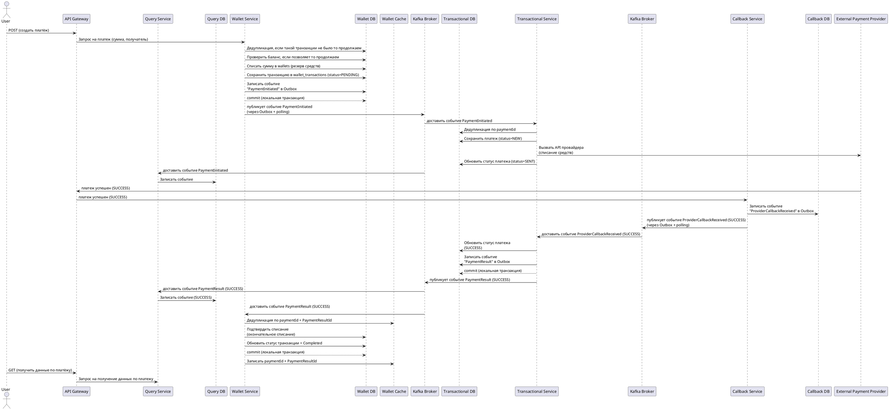
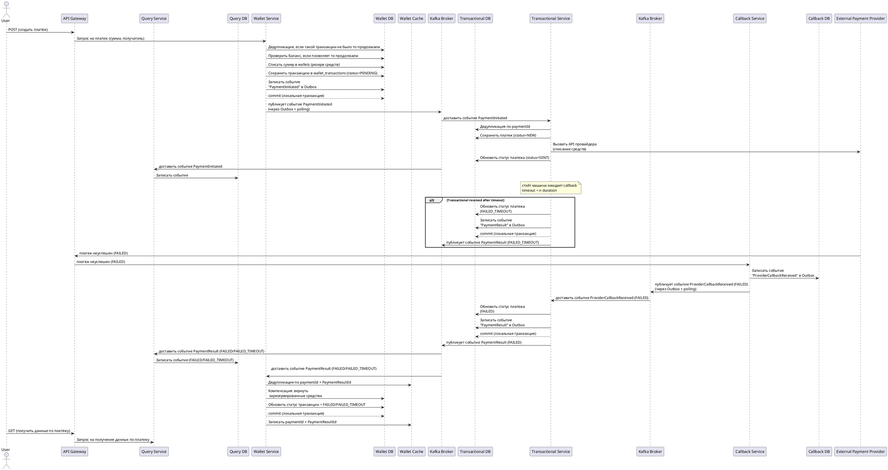
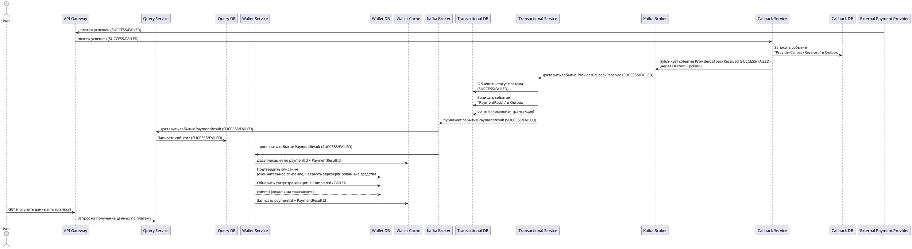
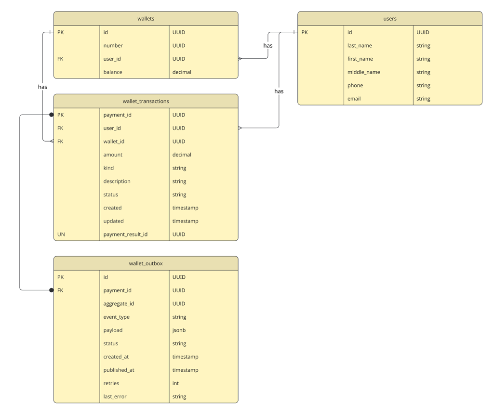
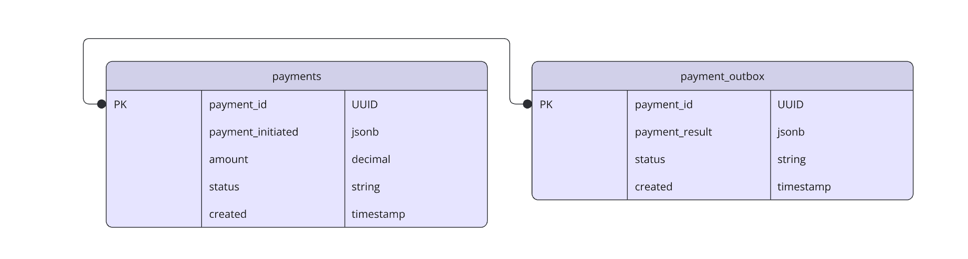
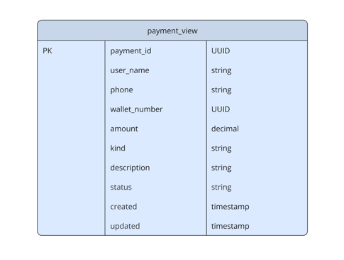

# Система обработки платежей с eventual consistency, Saga, Transactional Outbox и CQRS

## 1. C4 Container + Component диаграммы

### C4 Container
```plantuml
@startuml
!include https://raw.githubusercontent.com/plantuml-stdlib/C4-PlantUML/master/C4_Container.puml

Person(person, "Person", "Клиент банка, мобильный/веб")

Boundary(internal, "Payments system") {
Container(api_gateway, "API Gateway", "Nginx", "Единая точка входа для НТТР-запросов, аутентификация, маршрутизация")
Container(wallet, "Wallet Service", "Spring Boot app", "Управление балансами кошельков, резервирование средств и финальное списание/компенсация.")
Container(transaction, "Transaction Service", "Spring Boot app", "Оркестрация платежа,стэйт машина и интеграция с внешним платёжным провайдером")
Container(callback, "Callback Service", "Spring Boot app", "Принимает callback от провайдера")
Container(query, "CQRS Query Service", "Spring Boot app", "Сервис чтения данных")

ContainerDb(transactionDb, "Transaction DB + Outbox", "PostgreSQL Состояние платежей, outbox-события PaymentResult")
ContainerDb(walletDb, "Wallet DB + Outbox", "PostgreSQL Счета пользователей, платежи и outbox-события Paymentinitiated")
ContainerDb(walletCache, "Wallet Cache", "Redis")
ContainerDb(queryDb, "readingDB", "Elasticsearch")
SystemQueue(kafka, "Apache Kafka", "Асинхронный обмен событиями Paymentinitiated u PaymentResult между сервисами")

Rel(api_gateway, query, "HTTP GET, запрос истории платежей, запрос статуса платежа")
Rel(api_gateway, wallet, "HTTP POST, создать платеж")
Rel(api_gateway, callback, "HTTP POST, callback от провайдера")
Rel(kafka, transaction, "Kafka event [PaymentInitiated,ProviderCallbackReceived]")
Rel(kafka, wallet, "Kafka event [PaymentResult]")
Rel(kafka, queryDb, "Kafka event [PaymentInitiated,PaymentResult]")

Rel(wallet, walletDb, "Запись платежа и outbox-события Paymentinitiated")
Rel(wallet, walletCache, "Чтение/Запись paymentId + PaymentResultId")
Rel(walletDb, kafka, "Pub event [PaymentInitiated]")
Rel(transaction, transactionDb, "Запись платежа и outbox-события PaymentResult")
Rel(transactionDb, kafka, "Pub event [PaymentResult]")
Rel(callback, kafka, "Pub event [ProviderCallbackReceived]")
Rel(query, queryDb, "Чтение")

}

System_Ext(provider, "Provider System", "Внешний провайдер")

Rel(person, api_gateway, "HTTP REST API, запрос истории платежей / отправка платежа")
Rel(provider, api_gateway, "HTTPS Callback [Результат платежа]")
Rel(transaction, provider, "HTTPS API внешний вызов")

@enduml
```
### C4 Component 
**внутренние компоненты ключевых сервисов**

Wallet Service 
```plantuml
@startuml
!include https://raw.githubusercontent.com/plantuml-stdlib/C4-PlantUML/master/C4_Container.puml

Boundary(internal, "Wallet Service") {
Container(api_gateway, "API Gateway", "Nginx", "Единая точка входа для НТТР-запросов, аутентификация, маршрутизация")
Container(walletController, "Wallet Controller", "layer", "REST Controller")
Container(wallet, "Wallet Service", "layer", "Резервирование средств и финальное списание/компенсация")
Container(walletBalance, "Wallet Balance", "layer", "Управление балансами кошельков")
Container(walletEvent, "WalletEventHandler", "layer", "Обработка events из kafka")


ContainerDb(walletDb, "Wallet DB + Outbox", "PostgreSQL Счета пользователей, платежи и outbox-события Paymentinitiated")
ContainerDb(walletCache, "Wallet Cache", "Redis")
SystemQueue(kafka, "Apache Kafka", "Асинхронный обмен событиями Paymentinitiated u PaymentResult между сервисами")

Rel(api_gateway, walletController, "HTTP POST, создать платеж")
Rel(walletController, wallet, "Создать платеж")
Rel(kafka, walletEvent, "Kafka event [PaymentResult]")

Rel(wallet, walletBalance, "Проверка баланса")
Rel(walletBalance, walletDb, "Проверка баланса")
Rel(wallet, walletDb, "Запись платежа и outbox-события Paymentinitiated")
Rel(walletEvent, walletCache, "Дедупликация по paymentId + PaymentResultId")
Rel(walletEvent, wallet, "Обработка PaymentResult, списание/компенсация")
Rel(walletDb, kafka, "Pub event [PaymentInitiated]")
Rel(wallet, walletCache, "Запись paymentId + PaymentResultId")
}

@enduml
```
Transaction Service
```plantuml
@startuml
!include https://raw.githubusercontent.com/plantuml-stdlib/C4-PlantUML/master/C4_Container.puml

Boundary(internal, "Transaction Service") {
Container(PaymentInitiated, "PaymentInitiated", "Layer", "Оркестрация платежа, стэйт машина")
Container(PaymentProvider, "PaymentProvider", "Layer", "Интеграция с внешним платёжным провайдером")
Container(PaymentEvent, "PaymentEventHandler", "Layer", "Обработка events из kafka")

ContainerDb(transactionDb, "Transaction DB + Outbox", "PostgreSQL Состояние платежей, outbox-события PaymentResult")
SystemQueue(kafka, "Apache Kafka", "Асинхронный обмен событиями Paymentinitiated u PaymentResult между сервисами")

Rel(kafka, PaymentInitiated, "Kafka event [PaymentInitiated]")
Rel(kafka, PaymentEvent, "Kafka event [ProviderCallbackReceived]")
Rel(PaymentEvent, transactionDb, "Запись платежа и outbox-события PaymentResult")
Rel(transactionDb, kafka, "Pub event [PaymentResult]")

}

System_Ext(provider, "Provider System", "Внешний провайдер")

Rel(PaymentInitiated, transactionDb, "Дедупликация по paymentId")
Rel(PaymentInitiated, PaymentProvider, "Передаем платеж в провайдер")
Rel(PaymentProvider, provider, "HTTPS API внешний вызов")

@enduml
```
Query Service
```plantuml
@startuml
!include https://raw.githubusercontent.com/plantuml-stdlib/C4-PlantUML/master/C4_Container.puml

Person(person, "Person", "Клиент банка, мобильный/веб")

Boundary(internal, "Query Service") {
Container(api_gateway, "API Gateway", "Nginx", "Единая точка входа для НТТР-запросов, аутентификация, маршрутизация")
Container(query, "CQRS Query Service", "Layer", "Сервис чтения данных")
Container(CQRSEvent, "CQRS Event", "Layer", "Обработка events из kafka")

ContainerDb(queryDb, "readingDB", "Elasticsearch")
SystemQueue(kafka, "Apache Kafka", "Асинхронный обмен событиями Paymentinitiated u PaymentResult между сервисами")

Rel(api_gateway, query, "HTTP GET, запрос истории платежей, запрос статуса платежа")
Rel(kafka, CQRSEvent, "Kafka event [PaymentInitiated,PaymentResult]")
Rel(CQRSEvent, queryDb, "Запись PaymentInitiated, обновление PaymentResult")

Rel(query, queryDb, "Чтение")

}

Rel(person, api_gateway, "HTTP REST API, запрос истории платежей")

@enduml
```
## 2. Диаграммы последовательности
Основной успешный сценарий

Сценарий с ошибкой

Отдельная диаграмма для flow с callback-service

## 3. Описание API контрактов

**Внешние API**

Создание платежа

```http
POST /api/v1/payment HTTP/1.1
Host: host.com
Content-Type: application/json
Authorization: Bearer <token>

{
  "paymentId": "UUID",
  "wallet": "UUID",
  "amount": 999999999.99,
  "kind": "string",
  "description": "string",
  "timestamp": "yyyyMMdd-HH:mm:ss:SSSSSS"
}

Response

{
  "paymentId": "UUID",
  "timestamp": "yyyyMMdd-HH:mm:ss:SSSSSS"
}
```
_paymentId - является Idempotency Key_

callback API провайдера (endpoint Callback Service)

```http
POST /api/v1/callback HTTP/1.1
Host: host.com
Content-Type: application/json
Authorization: Bearer <token>

{
  "paymentId": "UUID",
  "status": "string",
  "description": "string",
  "timestamp": "yyyyMMdd-HH:mm:ss:SSSSSS"
}

Response

{
  "paymentId": "UUID",
  "timestamp": "yyyyMMdd-HH:mm:ss:SSSSSS"
}
```
Запрос статуса платежа (endpoint Query Service)

```http
GET /api/v1/payments/{id} HTTP/1.1
Host: host.com
Content-Type: application/json
Authorization: Bearer <token>

Response

{
    "paymentId": "UUID",
    "user_name": "string",
    "phone": "string",
    "wallet_number": "UUID",
    "amount": 999999999.99,
    "kind": "string",
    "description": "string",
    "status": "string",
    "created": "yyyyMMdd-HH:mm:ss:SSSSSS",
    "updated": "yyyyMMdd-HH:mm:ss:SSSSSS"
}
```

## 4. Описание сущностей (ERD-диаграмма)
**БД Wallet Service**
        

Описание таблиц:
* wallets - счета с остатками
* users - пользователи системы, владельцы счетов
* wallet_transactions - транзакции по счетам
* wallet_outbox - таблица для outbox pattern

**Redis** хранит paymentId + PaymentResultId для целей дедупликации PaymentResult (с настроенным persistence)

**БД Transaction Service**


Описание таблиц:
* payments - транзакции по счетам
* payment_outbox - таблица для outbox pattern

**БД Query Service (read-модель)**

Денормализованное представление ориентированное на чтение в Elasticsearch



## 5. Описание сообщений для брокера Apache Kafka

Форматы событий: 

**PaymentInitiated**
```json
{
  "typeEvent": "PaymentInitiated",
  "paymentId": "UUID",
  "wallet": "UUID",
  "amount": 999999999.99,
  "kind": "string",
  "description": "string",
  "timestamp": "yyyyMMdd-HH:mm:ss:SSSSSS"
}
```

**PaymentResult PaymentCompleted**
```json
{
  "typeEvent": "paymentCompleted",
  "paymentId": "UUID",
  "PaymentResultId": "UUID",
  "status": "string",
  "description": "string",
  "timestamp": "yyyyMMdd-HH:mm:ss:SSSSSS"
}
```

**PaymentResult PaymentFailed**
```json
{
  "typeEvent": "PaymentFailed",
  "paymentId": "UUID",
  "PaymentResultId": "UUID",
  "status": "string",
  "description": "string",
  "timestamp": "yyyyMMdd-HH:mm:ss:SSSSSS"
}
```
**ProviderCallbackReceived**
```json
{
  "typeEvent": "ProviderCallbackReceived",
  "paymentId": "UUID",
  "status": "string",
  "description": "string",
  "timestamp": "yyyyMMdd-HH:mm:ss:SSSSSS"
}
```

## 6. Описание процесса исполнения платежа

* От клиента приходит запрос по REST API в API Gateway, проходит проверку JWT токен
* API Gateway вызывает Wallet Service по REST API
* Wallet Service в первую очередь дедуплицирует, проверяет по таблице wallet_transactions, не было ли ранее транзакции с таким paymentId, 
такие образом реализуется идемпотентность, если не было такой операции, то проверяет по таблице wallets баланс по счету, если он больше или равен сумме платежа, то продолжаем
* Wallet Service начинает процесс Saga, для записи транзакции и отправки эвента в kafka применяет outbox pattern: в одной 
физической транзакции БД уменьшает баланс в wallets на сумму платежа, создает запись об операции в таблице wallet_transactions в статусе pending и создает запись в wallet_outbox 
записывая event PaymentInitiated в статусе new, в обеих записях первичный ключ payment_id, в этом месте с помощью outbox pattern 
реализуется атомарность записи операции по счету и записи эвента, который нужно отправить в кафку (либо оба записали, либо ни одного)
* Wallet Service с помощью polling вычитывает записи из wallet_outbox в статусе new и отправляет в Apache Kafka event PaymentInitiated,
в случае успешной отправки меняет статус записи на sent
* Payment Query Service получает event PaymentInitiated из Apache Kafka, дедуплицирует его по paymentId таблицы payment_view 
и если такого не было добавляет запись в payment_view
* Transaction Service получает event PaymentInitiated из Apache Kafka и в первую очередь дедуплицирует его, проверяя по 
таблице payments по реквизиту paymentId таким образом реализуется идемпотентность, если не было такого платежа, то продолжаем
* Transaction Service запускает стейт машину (которая проводит операции по статусам) и создает запись об операции в 
таблице payments в статусе new
* Transaction Service вызывает по HTTP API внешнего провайдера, отправляет в него платеж, при успешной отправке меняет статус в payments на sent, 
при ошибке и исчерпании попыток retry - в одной физической транзакции БД: 
1. меняет статус операции в payments на error
2. создает запись в payment_outbox записывая event PaymentResult(PaymentFailed) (формируем в нем PaymentResultId) в статусе new

В обеих записях первичный ключ payment_id, в этом месте с помощью outbox pattern реализуется атомарность смены статуса
   операции и запись эвента, который нужно отправить в кафку (либо оба записали, либо ни одного)
* В Transaction Service стейт машина ожидает подтверждение по операции n duration (настройка) если не дожидается - 
в одной физической транзакции БД:
1. меняет статус операции в таблице payments на error_timeout
2. создает запись в payment_outbox записывая event PaymentResult(PaymentFailed) (формируем в нем PaymentResultId) в статусе new

В обеих записях первичный ключ payment_id, в этом месте с помощью outbox pattern реализуется атомарность смены статуса 
операции и запись эвента, который нужно отправить в кафку (либо оба записали, либо ни одного)
* Callback Service принимает HTTP callback (через API Gateway) от внешнего провайдера, валидирует подпись, дедуплицирует и сохраняет в CallbackDb событие ProviderCallbackReceived в Outbox
* Callback Service с помощью polling вычитывает записи из payment_outbox в статусе new и отправляет в Apache Kafka
* В Transaction Service получает event ProviderCallbackReceived и в одной физической транзакции БД:
1. меняет статус операции в таблице payments на Completed
2. создает запись в payment_outbox записывая PaymentResult(PaymentCompleted) (формируем в нем PaymentResultId) в статусе new

В обеих записях первичный ключ payment_id, в этом месте с помощью outbox pattern реализуется атомарность смены статуса 
операции и запись эвента, который нужно отправить в кафку (либо оба записали, либо ни одного)
* Transaction Service с помощью polling вычитывает записи из payment_outbox в статусе new и отправляет в Apache Kafka 
event PaymentResult(PaymentCompleted/PaymentFailed), в случае успешной отправки меняет статус записи на sent
* Wallet Service получает event PaymentResult(PaymentCompleted/PaymentFailed) из Apache Kafka, дедуплицирует его проверяя 
по ключу paymentId + PaymentResultId в Redis.
Если в Redis такого ключа нету, еще проверим в wallet_transactions по полю payment_result_id.
Если есть в Redis / wallet_transactions.payment_result_id, то это дубль отбрасываем его.
Если нету,то это не дубль, завершаем процесс Saga ранее начатый в Wallet Service.

Кейсы:

_PaymentCompleted_ - одним update меняем статус wallet_transactions на Completed и присваиваем payment_result_id

_PaymentFailed_ - в одной транзакции БД: 
1. wallets.balance увеличиваем на wallet_transactions.amount
2. одним update меняем статус wallet_transactions на Cancelled и присваиваем payment_result_id

Далее после окончания транзакции БД записываем в Redis paymentId + PaymentResultId

Координатором саги является распределенная хореография через события

* Payment Query Service получает event PaymentResult(PaymentCompleted/PaymentFailed) из Apache Kafka, в payment_view обновляет
запись по payment_id
* При запросе на чтение информации о платеже, читаем из Elasticsearch Query Service тем самым реализуем CQRS при котором запросы на
чтение обрабатывает отдельная система со своей БД и reading моделью. Используем Elasticsearch: хорош для полнотекстового поиска, 
фильтрации по полям (искать платежи по имени клиента, статусу, описанию)

